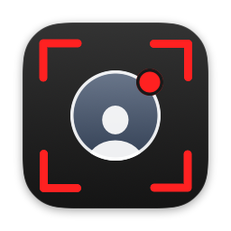
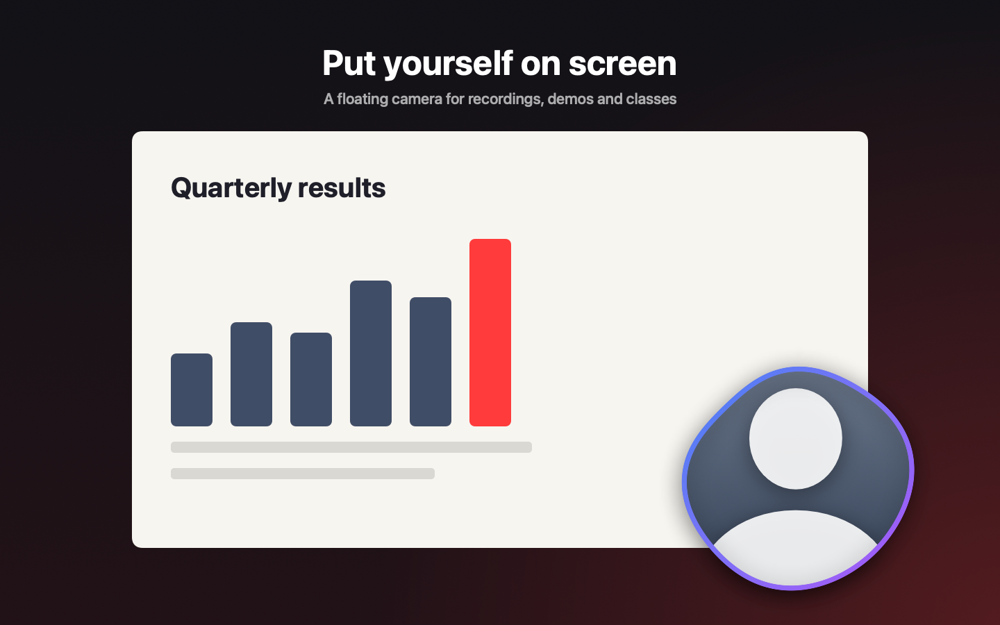
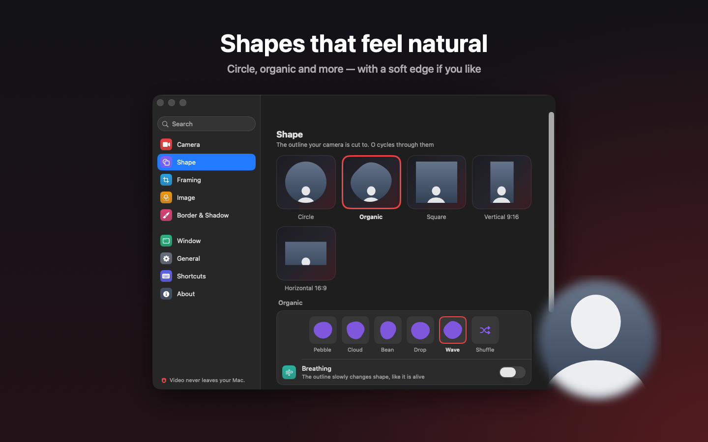
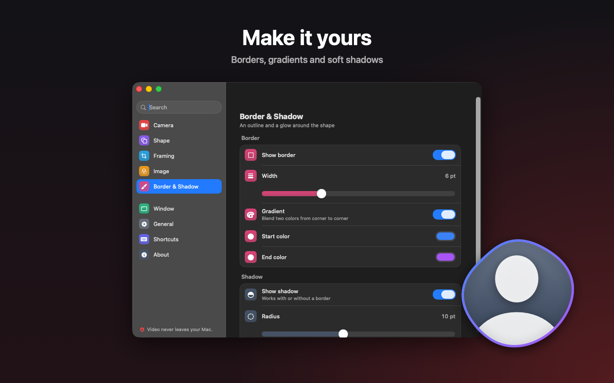
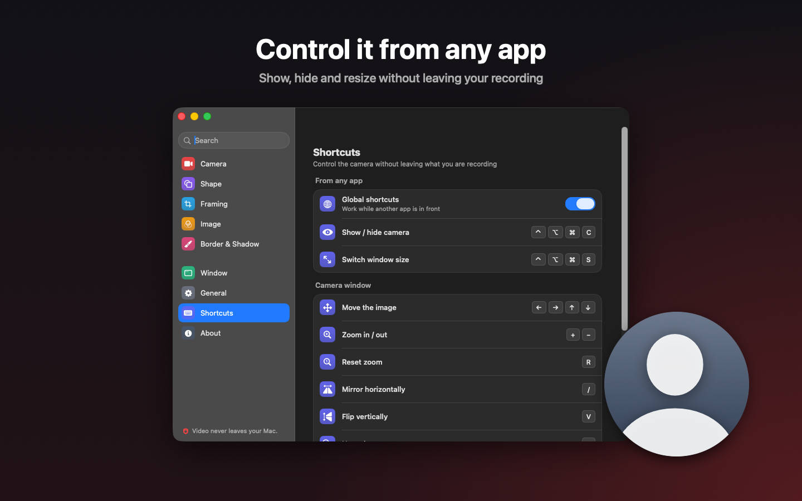
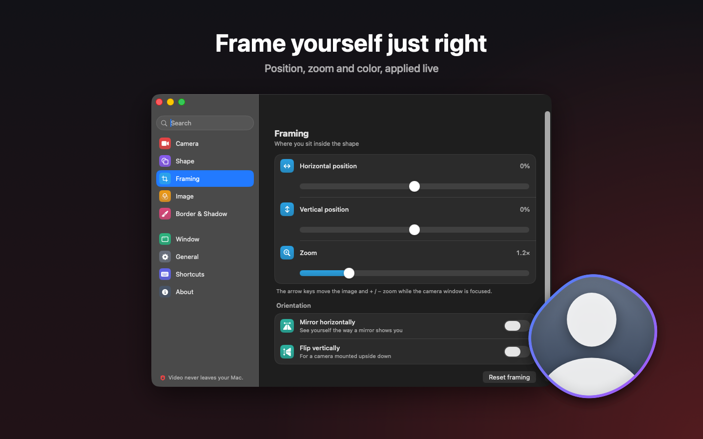

<p align="center">
  
</p>

<h1 align="center">CameraMan</h1>

<p align="center">
  A floating camera for your Mac — put yourself on screen in recordings, demos, classes and calls.<br>
  <a href="https://github.com/lucianodiisouza/camera-man-macos/releases/latest"><b>Download the latest release</b></a> · Mac App Store (in review) · English &amp; Português (Brasil)
</p>

<p align="center">
  
</p>

## Features

- **Made for recording**: global shortcuts work from any app (⌃⌥⌘C show/hide, ⌃⌥⌘S switch size); the bubble follows you across desktops and over full-screen apps; the camera turns off completely while hidden or while the screen is locked
- **Shapes**: circle, organic (five presets, shuffle, optional breathing motion), square, vertical 9:16 and horizontal 16:9, with soft edge and corner radius
- **Framing**: move the image inside the shape, zoom, mirror or flip
- **Look**: brightness, contrast and saturation on the GPU; solid or gradient border; soft shadow; works with macOS video effects (Portrait, Studio Light, backgrounds)
- **Window**: five sizes, snap to any corner, each size remembers its own place, Space switches between your two favourite sizes
- **Light**: sharp HD image at about 3% CPU and ~27 MB of memory
- **Settings window** in the style of System Settings, with search
- **Menu bar** icon, optional Dock icon, open at login
- **Private**: no network access, no account, no analytics — video never leaves your Mac

<table>
  <tr>
    <td></td>
    <td></td>
  </tr>
  <tr>
    <td></td>
    <td></td>
  </tr>
</table>

## Install

Download `CameraMan-<version>.dmg` from [Releases](https://github.com/lucianodiisouza/camera-man-macos/releases/latest), open it and drag CameraMan to Applications. The app is signed and notarized by Apple, so it opens without warnings. On first launch macOS asks for camera access.

Requires macOS 14 Sonoma or later.

## Keyboard shortcuts

| Action | Keys | Where |
|---|---|---|
| Show / hide camera | ⌃⌥⌘C | any app |
| Switch window size | ⌃⌥⌘S | any app |
| Move the image | ← → ↑ ↓ | camera window |
| Zoom in / out, reset | + / −, R | camera window |
| Mirror / flip | / , V | camera window |
| Next shape | O | camera window |
| Next camera | ⌫ | camera window |
| Switch window size | Space | camera window |
| Settings | ⌘, | menu |

Global shortcuts can be turned off in Settings → Shortcuts.

## Build from source

Requirements: macOS 14+, Xcode 16+, a camera.

1. Open `CameraMan.xcodeproj` in Xcode.
2. Select the **CameraMan** scheme and **My Mac**, then Build and Run (⌘R).

Or from the command line:

```bash
xcodebuild -scheme CameraMan -configuration Debug -destination 'platform=macOS' -derivedDataPath build build
open build/Build/Products/Debug/CameraMan.app
```

Sign debug builds with your own development team (Signing & Capabilities). Ad-hoc builds work, but macOS asks for camera access again after every rebuild, because it remembers the permission per signature.

## Distribution

### DMG (signed and notarized)

Prerequisite (first time only): `brew install create-dmg`

```bash
./create-dmg.sh
```

It builds a universal Release, signs it with a Developer ID certificate (hardened runtime + App Sandbox + camera entitlement), notarizes and staples both the app and the DMG, and writes `CameraMan-<version>.dmg` in the project root, with the version from `MARKETING_VERSION`. It reads two settings from the environment or from a git-ignored `.env.local`:

```bash
CAMERAMAN_SIGN_IDENTITY="Developer ID Application: Your Name (TEAMID)"
CAMERAMAN_NOTARY_PROFILE="your-notary-profile"   # from: xcrun notarytool store-credentials
```

Without them the DMG is still built, but ad-hoc signed, and macOS blocks it on other Macs.

DMG copies don't update themselves: new versions are published on GitHub Releases. App Store copies update through the App Store.

### Mac App Store

```bash
./appstore.sh            # archive + export a signed .pkg to build/appstore
./appstore.sh --upload   # archive + upload to App Store Connect
```

Signing is automatic through the Apple account in Xcode → Settings → Accounts. Listing text (English and Portuguese), review notes and screenshot sizes are in [appstore/LISTING.md](appstore/LISTING.md); the privacy policy is [PRIVACY.md](PRIVACY.md).

Screenshots are composed from real captures of the settings window by [appstore/screenshots/compose.swift](appstore/screenshots/compose.swift); `--readme` writes the images used on this page.

### App icon

```bash
swift generate-icon.swift
```

## Localization

English and Brazilian Portuguese, in String Catalogs (`CameraMan/Localizable.xcstrings`, `CameraMan/InfoPlist.xcstrings`). CameraMan follows the Mac's language; Settings → General → Language opens the macOS setting to pick one just for CameraMan.

## Contributing

Contributions are welcome. See [CONTRIBUTING.md](CONTRIBUTING.md) for guidelines and [CODE_OF_CONDUCT.md](CODE_OF_CONDUCT.md) for community standards. Security issues: [SECURITY.md](SECURITY.md).

## Changelog

See [CHANGELOG.md](CHANGELOG.md) for version history.

## License

MIT
